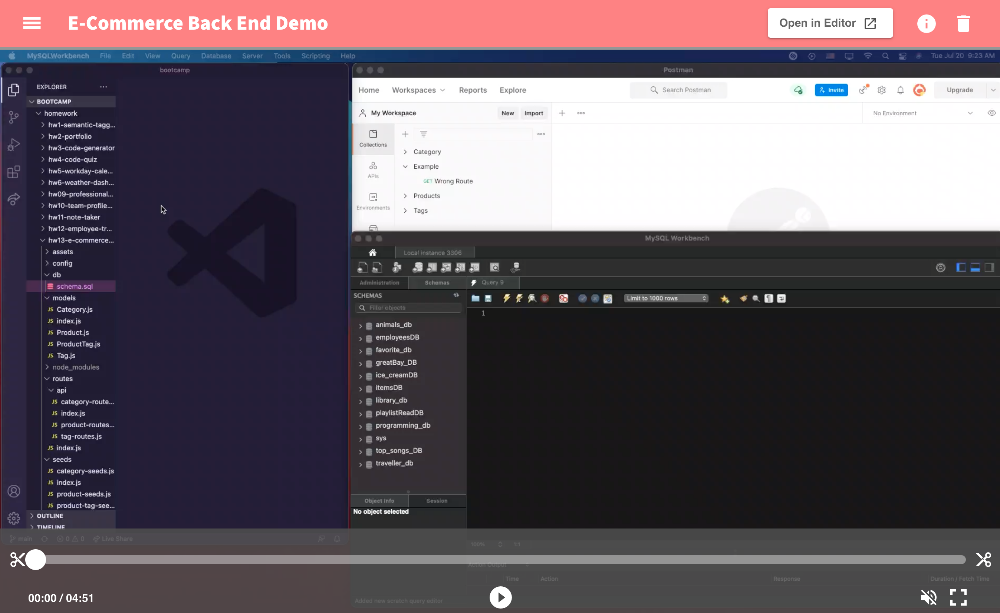

# E-Commerce Back-End

## Screenshot of E-Commerce Back End



## Demo of the app

To run the app you will need to use the following programs:
* VS Code
* MySQLWorkbench
* Postman (In our Cohort we learned how to use Postman instead of Insomnia, therefore the Demo for this video was done in Postman)

To run the app you will need to follow the next few steps:

* Open VS Code
* Open the schema file in the folder ** ./db/schema.sql and copy the content in the file
* Open MySQLWorkbench
* Paste the content you copied from the schema file to create the DB
* Go to the root of the folder and type to seed the tables you created on MYSQLWorkbench

```
npm run seed
```
Once you verify the tables have been seeded run the following command in the root of the project so you access the server
```
node server.js
```

#### Go to Postman and start requesting information form the api. Watch the demo below to get an idea of how to do this. 
---

(Click on the image below to be redirected to the Youtube demo video)

[](https://youtu.be/2fE65vyScys)

---
## My task

Your task is to build the back end for an e-commerce site by modifying starter code. You’ll configure a working Express.js API to use Sequelize to interact with a MySQL database.

Because this application won’t be deployed, you’ll also need to provide a link to a walkthrough video that demonstrates its functionality and all of the acceptance criteria being met. You’ll need to submit a link to the video and add it to the readme of your project.

I created the models and the routes for this project.


